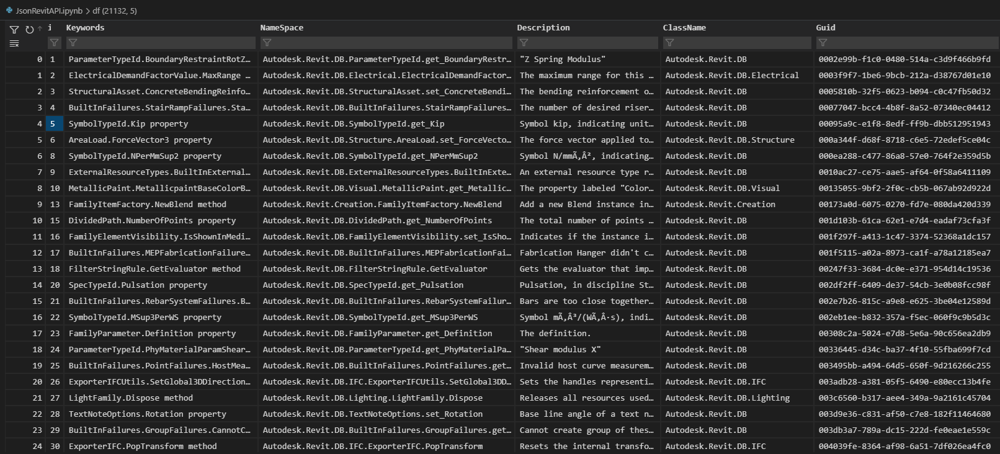
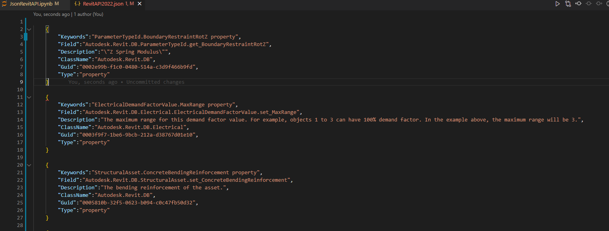

### Summary
Project Support Map method or properties with document [revitapidoc](https://www.revitapidocs.com/) online , we can use data guid to check with name method, properties to check.

let see this problem [Revitlookupwpf](https://github.com/weianweigan/RevitLookupWpf/issues/20#issuecomment-1040504071) to see detail.

### How to use : 
Install some package: 
- Pandas
- BeautifulSoup

### Step by step:
- Extract file htm from file chm RevitAPI
- Install all package request
- Run file JsonRevitAPI.ipynb
- See file json output

#### Demo Data

#### Demo Json

