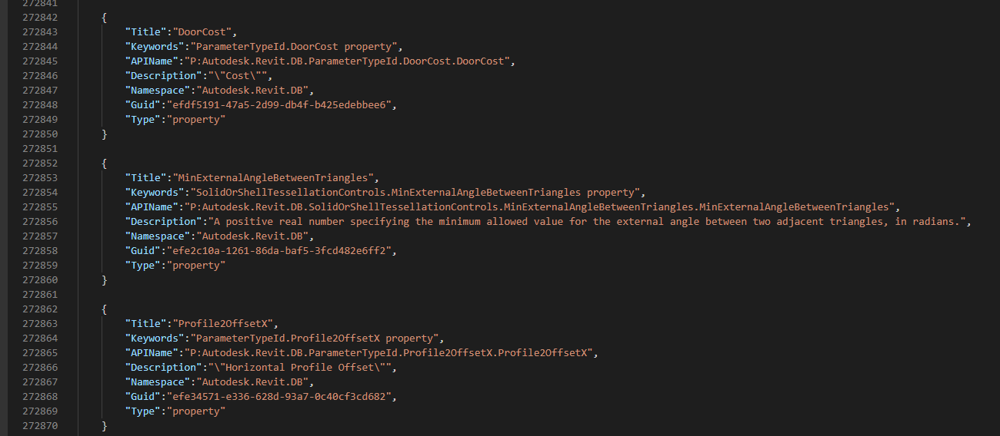

### Summary
Project Support Map method or properties with document [revitapidoc](https://www.revitapidocs.com/) online , we can use data guid to check with name method, properties to check.

let see this problem [Revitlookupwpf](https://github.com/weianweigan/RevitLookupWpf/issues/20#issuecomment-1040504071) or [revitapidoc](https://github.com/gtalarico/revitapidocs/issues/97) to see detail.

### How to use : 
Install some package: 
- pip install pandas
- pip install beautifulsoup4

### Step by step:
- Extract file htm from file chm RevitAPI or crawl data from website [<https://www.revitapidocs.com/>](https://www.revitapidocs.com/)
- Install all package request
- Change path folder contain all file htm in file JsonRevitAPI.ipynb and run
- See file `json` and `csv` output

#### Demo Data


#### Demo Json

``` json
 {
        "Title":"DoorCost",
        "Keywords":"ParameterTypeId.DoorCost property",
        "APIName":"P:Autodesk.Revit.DB.ParameterTypeId.DoorCost",
        "Description":"\"Cost\"",
        "Namespace":"Autodesk.Revit.DB",
        "Guid":"efdf5191-47a5-2d99-db4f-b425edebbee6",
        "Type":"property"
    }

```
Result link to go to : [https://www.revitapidocs.com/2022/efdf5191-47a5-2d99-db4f-b425edebbee6.htm](https://www.revitapidocs.com/2022/efdf5191-47a5-2d99-db4f-b425edebbee6.htm)



### How to read to project 

#### Use csharp

``` cs
public class RevitInfo
    {
        [JsonProperty("Title")]
        public string Title { get; set; }
        [JsonProperty("Keywords")]
        public string Keywords { get; set; }
        [JsonProperty("APIName")]
        public string APIName { get; set; }
        [JsonProperty("Description")]
        public string Description { get; set; }
        [JsonProperty("NameSpace")]
        public string NameSpace { get; set; }
        [JsonProperty("Guid")]
        public string Guid { get; set; }
        [JsonProperty("Type")]
        public string Type { get; set; }
    }
```
``` cs
using Newtonsoft.Json;
string filepath = @"C:\Users\Chuong.Ho\3D Objects\RevitAPIGen\RevitAPI2022.json";
using (StreamReader r = new StreamReader(filepath))
{
    string json = r.ReadToEnd();
    List<RevitInfo>? deserializeObject = JsonConvert.DeserializeObject<List<RevitInfo>>(json);
    string query = "Autodesk.Revit.DB.BuiltInFailures.InterferenceFailures.GeometryWarning";
    string guid = deserializeObject.First(x => x.APIName.Contains(query)).Guid;
    string revitVersion = "2022";
    string linkQuery = $"https://www.revitapidocs.com/{revitVersion}/{guid}.htm";
    Console.WriteLine(linkQuery);
}

```

#### Use Python

Read csv 
``` py
import pandas as pd
df = pd.read_csv("RevitAPI2022.csv")
df.head(10)
```

Read Json
``` py
import json
from pandas import DataFrame
with open('RevitAPI2022.json') as f:
    data = json.load(f)
df = DataFrame(data)
df.head(10)
```

### Warning 

Project can't get everything, some function or properties can't search or include in file `json` or export to `csv`.If you want improve for this, please create a pull request !